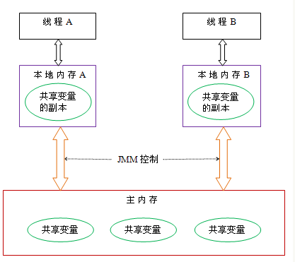
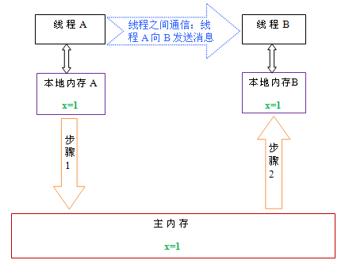

## 前言
本文主要讲解Java内存模型JMM协议，包括线程间通信、内存屏障等相关内容。

## Java内存模型
**Java内存模型，简称JMM，是一种解决JVM中缓存一致性和指令重排序问题的协议。**

#### 缓存一致性问题

> 在现代计算机中，因为CPU的运算速度远大于内存的读写速度，因此为了不让CPU在计算的时候因为实时读取内存数据而影响运算速度，CPU会加入一层缓存， 在运算之前缓存内存的数据，CPU运算的时候操作的是缓存里的数据，运算完成后再同步回内存。 这样虽然能够加速程序的运行速度，但是却带来了一个问题：缓存一致性问题。
>
> 每个处理器都有自己的缓存，而它们又共享同一内存，当有多个处理器的操作涉及同一块内存区域的时候，他们的缓存可能会因为运算而导致不一致，在这种情况下，同步回内存的数据以谁的为准呢？
>
> 为了解决一致性问题，需要各个处理器访问缓存的时候都遵循一些协议，在读写时要根据协议来进行操作。
>
> 而Java中的线程在执行的时候，为了提高速度，也会把线程中使用到的公共变量缓存到线程本地备份，线程执行时实际操作的是线程本地备份，运算完成后再同步到公共变量。Java这种机制可以看成是硬件缓存之上的一种抽象，在Java实现于特定硬件的时候，就可以把公共变量保存到内存，把线程本地备份保存到CPU缓存从而提升运行速度。Java的这种缓存机制和硬件的缓存机制一样，存在缓存一致性问题。Java的缓存一致性问题怎么解决，参考处理器缓存一致性的解决方案，我们认为应该也需要某种协议。

**什么是重排序问题？**

> 编译器在编译的时候，允许重排序指令以优化运行速度。CPU在执行指令的时候，为了使处理器内部运算单元能被充分利用，也可以对指令进行乱序执行。
>
> 在编译器和CPU进行重排序的时候，要遵循“as-if-serial”原则，也就是要保证程序单线程执行的时候，重排序之后程序的运行结果必须和重排序前程序的运行结果一致。这里注意“as-if-serial”原则只保证单线程的执行结果不变，不保证多线程执行的结果不变。那么如何保证多线程程序的正确运行？显然需要某种协议来限定多线程执行时要满足的规则。

## Java线程间通信
上面提到Java线程间通信需要遵守JMM协议，否则无法保证缓存一致性和指令重排导致的问题。

从抽象角度看，JMM协议定义了线程和主内存之间的抽象关系：线程之间的共享变量存储在主内存中（main memory），每个线程都有一个私有的本地工作内存（local memory），本地内存中存储了该线程以读/写共享变量的副本。

本地内存是JMM的一个抽象概念，并不真实存在。它涵盖了缓存，写缓冲区，寄存器以及其他的硬件和编译器优化。Java内存模型的抽象示意图如下：

从上图来看，线程A与线程B之间如要通信的话，必须要经历下面2个步骤：
首先，线程A把本地内存A中更新过的共享变量刷新到主内存中去。
然后，线程B到主内存中去读取线程A之前已更新过的共享变量。

如上图所示，本地内存A和B有主内存中共享变量x的副本。假设初始时，这三个内存中的x值都为0。线程A在执行时，把更新后的x值（假设值为1）临时存放在自己的本地内存A中。当线程A和线程B需要通信时，线程A首先会把自己本地内存中修改后的x值刷新到主内存中，此时主内存中的x值变为了1。随后，线程B到主内存中去读取线程A更新后的x值，此时线程B的本地内存的x值也变为了1。

从整体来看，这两个步骤实质上是线程A在向线程B发送消息，而且这个通信过程必须要经过主内存。JMM通过控制主内存与每个线程的本地内存之间的交互，来为java程序员提供内存可见性保证。

