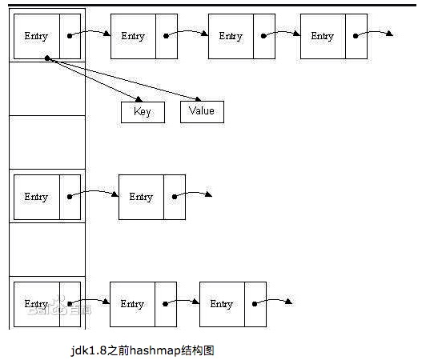
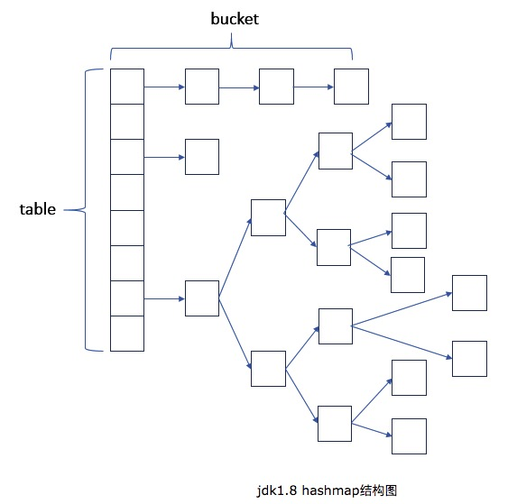

https://www.cnblogs.com/xiaoxi/p/7233201.html

https://www.cnblogs.com/qiumingcheng/p/5259892.html

## 前言

Map是Java很常用的一个集合，不同于List的单列线性集合，Map是一种双列映射的存储结合。

`双列映射`：一列key，一列value，两者一一对应，也就是我们常说的键值对结构。

Map结构中的key是唯一的，虽然不同的map有的允许key为null，有的不允许，但key还是必须唯一，即便为null也只能允许有一个。

map的特点：
- K-V结构，一对一映射
- K具有唯一性，不可重复
- 根据K快速定位到V

    注：一般不建议使用对象作为Map的K，如果非要这样做，请重写对象的hashCode()和equal()

## 常见的Map

简单的区别如下：
- HashMap：非线程安全的键值对集合。
- TreeMap：有序的非线程安全的键值对集合。
- HashTable：线程安全的键值对结合。
- LinkedHashMap：是 HashMap 的一个子类，它保留插入的顺序，非线程安全。
- ConcurrentHashMap：线程安全，在加锁粒度上比HashTable要细，性能会更好一些。

## HashMap
- 继承关系：`class HashMap<K,V> extends AbstractMap<K,V> implements Map<K,V>, Cloneable, Serializable`
- K-V-NULL：只允许一个key为null，可以有一个或者多个value为null。
- 是否安全：`非线程安全`，要转成线程安全可使用Collections.synchronizedMap(map)（生成代理类，方法都加上synchronized，类似HashTable）
- 初始容量：hash数组初始化默认大小是16，而且一定是2的指数。负载因子是0.75，扩容公式是：当元素数量达到阈值(当前容量*0.75)，则原容量*2
- 哈希值的使用：HashMap是hash对key的hashcode进行了二次hash，以获得更好的散列值。
- 底层结构：JDK1.8对HashMap进行了比较大的优化，底层实现由之前的`数组+链表`改为`数组+链表+红黑树`

jdk7和jdk8中HashMap结构的最大区别就是引入了红黑树，当table中某一格的单链表超过8位长度，就重新计算hash转成红黑树结构存储。

HashMap每个键值对是怎么存储的?
- 初始HashMap有16格`transient Node<K,V>[] table;`
- 计算K的hash值，put(K, V)源码可见`(key == null) ? 0 : (h = key.hashCode()) ^ (h >>> 16)`
- 将K, V封装成Node对象，按hash值存储到对应的table中的某一格，数组存储模式
- 当出现不同的K值，但是计算生成的hash值一样时，会放到同一格，并采用链表LinkedHashMap存储
- 当同一格的链表节点超过8个，则单格的链表采用红黑树进行存储
- 扩容的时候，会对整个HashMap重新计算hash进行存储

关于JDK1.8的HashMap源码分析，有一篇很好的文章 [JDK1.8 HashMap源码分析](https://www.cnblogs.com/xiaoxi/p/7233201.html)

**HashMap是线程不安全的，会导致什么情况？**
- 假设多个线程同时put，且刚好都触发了扩容，同时进入了transfer方法。
- 极端情况下有可能形成循环链表

**线程不安全是因为扩容，那么扩容到底做了什么？**

HashMap的一些参数：
- Capacity：HashMap的当前长度，HashMap的长度是2的幂。
- LoadFactor：HashMap负载因子，默认值为0.75f。
- 扩容条件：HashMap.Size >= Capacity * LoadFactor

其实这个并发问题就是HashMap的resize()并发导致的问题，下面说说什么是resize()以及resize()做了啥。

- 每当触发扩容，会执行resize()
- 创建一个新的Entry空数组，长度是

程序猿小灰这篇文章了解下！！！

[漫画：高并发下的HashMap](https://mp.weixin.qq.com/s?__biz=MzI2NjA3NTc4Ng==&mid=2652079766&idx=1&sn=879783e0b0ebf11bf1a5767933d4e61f&chksm=f1748d73c6030465fe6b9b3fa7fc816d4704c91bfe46cb287aefccee459153d3287172d91d23&scene=21#wechat_redirect%20---------------------%20%E6%9C%AC%E6%96%87%E6%9D%A5%E8%87%AA%20walkerchi%20%E7%9A%84CSDN%20%E5%8D%9A%E5%AE%A2%20%EF%BC%8C%E5%85%A8%E6%96%87%E5%9C%B0%E5%9D%80%E8%AF%B7%E7%82%B9%E5%87%BB%EF%BC%9Ahttps://blog.csdn.net/chisunhuang/article/details/79041656?utm_source=copy)

## TreeMap
`非线程安全``fail-fast``key有序`
- 非线程安全
- 继承关系：`class TreeMap<K,V> extends AbstractMap<K,V> implements NavigableMap<K,V>, Cloneable, java.io.Serializable`
HashMap和TreeMap 最大的区别就是TreeMap具备排序功能。默认情况下，存入TreeMap中的KV，会按照KEY进行升序排列。当然，开发者可以自定义比较器来改变这种默认排序行为。
- 在定义TreeMap的时候，可以传入一个比较器：TreeMap(Comparator<? super K> comparator)

## HashTable

- 使用的synchronized保证线程安全
- 继承关系：`class Hashtable<K,V> extends Dictionary<K,V> implements Map<K,V>, Cloneable, java.io.Serializable`
- 初始容量：HashTable的初始容量是11，负载因子和HashMap一样都是0.75，扩容公式是 old*2+1
- key和value都不允许null值，否则抛出NullPointerException异常。
- 哈希值的使用：HashTable计算hash是直接使用key的hashcode对table数组的长度直接进行取模。
- synchronized锁保证强一致性，效率相对较低

## LinkedHashMap

继承关系：`class LinkedHashMap<K,V> extends HashMap<K,V> implements Map<K,V>`
- HashMap的子类，非线程安全
- 内部采用

- LinkedHashMap：HashMap的子类，内部采用双向链表实现，可以保持顺序。

## ConcurrentHashMap
`线程安全``分段锁``无序``key和value不能为null`
- 锁分段技术保证线程安全【将数据分成一段一段的存储，然后给每一段数据配一把锁】
- 根据默认的并发级别(concurrency level)，Map被分割成16部分，并且由不同的锁控制。这意味着，同时最多支持16个写线程操作ConcurrentHashMap。
- 当一个线程占用锁访问其中一个段数据的时候，其他段的数据也能被其他线程访问，所以ConcurrentHashMap是在每个段（segment）中线程安全的。
- 不允许key和value为null
- key是以为的，value值可以重复
- 无序
- 优点：适用于读多写少的map，最多支持16个写线程同时操作，读线程几乎不受影响，可保证高并发同时访问，性能的提升是显而易见的。
- 缺点：安全性较弱，同时读写的时候，读的数据可能可能是A，写完后可能AB.

## Java中遍历Map的几种方式
#### Jdk8 foreach()

Map<String, String> map = new HashMap<>();
map.put("1","1");
map.put("2","2");
map.forEach((k, v) -> {
    System.out.println(k + "==>" + v);
});


#### map.entrySet()

Map<String, String> map = new HashMap<>();
map.put("1","1");
map.put("2","2");

for(Map.Entry<String, String> entry : map.entrySet()){
    System.out.println(entry.getKey()+ ","+  entry.getValue());
}


#### 分别遍历key/value

Map<String, String> map = new HashMap<>();
map.put("1","1values");
map.put("2","2values");
//遍历key
for(String s : map.keySet()){
    System.out.println(s);
}
//遍历values
for(String s : map.values()){
    System.out.println(s);
}
