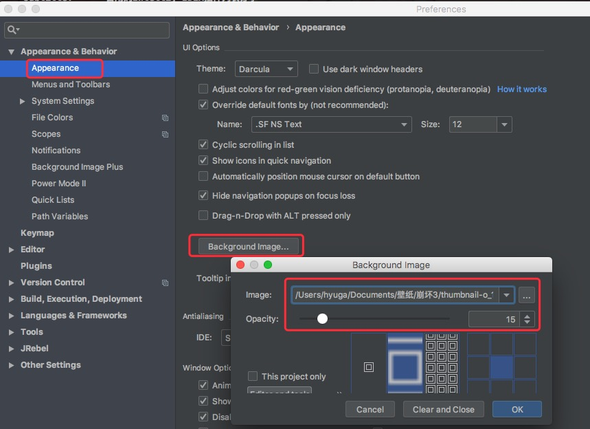

## 前言
以下是平时自己用的IDEA Plugins列表，仅做简单归类记录，不做使用详解，感兴趣的自行搜索。

## 壁纸
#### IDEA自带背景设置
设置背景图，仅限单张

#### Background Image Plus
设置背景图，可选择文件夹，定时轮播

## 美化
#### Rainbow Brackets
小括号颜色渲染很舒服

#### Power Mode II

## 翻译
#### Translation
翻译神器，最好用的idea翻译插件，没有之一。支持三种翻译软件api

#### CodeGlance
右边生成快捷预览图，便于竖屏滚动和预览类长度

#### Grep Console
日志样式颜色自定义

## 开发规范
#### Alibaba Java Coding Guidelines
阿里巴巴开发手册规范，规范自己的代码风格

#### FindBugs-IDEA
可检测出项目中各种隐藏的可以优化的问题代码

## 部署神器
#### Jrebel for IntelliJ
超给力热部署插件，收费，请支持正版，绝对物超所值

## Mybatis相关
#### iBATIS/MyBatis mini-plugin
快捷跳转到Mapper.xml方法工具

Free Mybatis plugin效果和上面的差不多

#### Mybatis Log Plugin
生成sql自动将参数替换到占位符中，方便测试执行

## Json相关
#### GsonFormat
json转bean实体

## 高效plugins
#### associate-doc.jar
java文件中关联doc.md快捷  `@doc xxx.md`

#### generate-gs-doc.jar
快捷生成bean的所有get、set方法

#### Generate-all-set.jar
快捷生成bean的所有set方法

## 调试工具
#### VisualVM Launcher
jvm监控工具

#### Api Debugger
类似于chrome的postman

## Maven相关
#### Maven Helper
Maven优秀插件，便于解决jar包冲突等问题

#### .ignore
生成git项目忽视文件，跳过不需要提交的文件

#### AceJump
快速定位单词光标，不用鼠标点点点，想跳到当前编辑窗口的哪个单词都可以

快捷键：`command+,`

## 反编译
#### ASM Bytecode plugin
反编译神器!!!来源：https://github.com/mrdear/asm-bytecode-intellij

配置: [--stringbuilder false --arrayiter fase --collectioniter false --decodelambdas false --sugarboxing false]

## Markdown
#### Markdown Navigator
还可以吧，idea中编辑`.md`文件，基本的渲染效果还行。